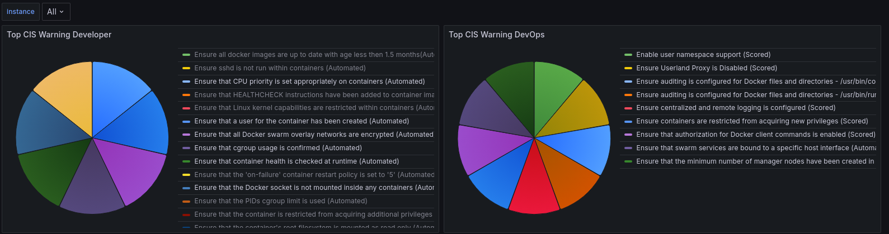

# CIS Exporter

This exporter reads the Docker CIS Benchmark results as a JSON file and then generate the metrics to give input for Prometheus.

## CIS Exporter in Monitoring Diagram



## Usage

```sh
usage: cis_exporter.py [-h] -f JSON_FILE -t REFRESH_TIME --timebase {second,minute,hour} [-P PORT] [--severity [{INFO,WARN,PASS,NOTE} ...]] [--enable_default_collectors]
                       [--filter_fields [{id,desc,result,details} ...]]

CIS Metric Exporter Usage Guide

options:
  -h, --help            show this help message and exit
  -f JSON_FILE, --json_file JSON_FILE
  -t REFRESH_TIME, --refresh_time REFRESH_TIME
                        Refreshing time between 1 and 24 hours
  --timebase {second,minute,hour}
                        Valid times are secondly, minutely, and hourly
  -P PORT, --port PORT  Default listening port is 9091
  --severity [{INFO,WARN,PASS,NOTE} ...]
                        Filters metrics by single or multi severity:
                        --severity WARN
                        --severity INFO PASS
  --enable_default_collectors
                        Activates the base system metrics
  --filter_fields [{id,desc,result,details} ...]
                        Filter labels on chosed fields to display:
                        --filter_fields id desc
                        --filter_fields id desc results
```

#### Runtime Settings: Docker

Starts exporter with a 5 seconds refreshing time over sample data to use for `demo` purposes:

```sh
$ git clone https://github.com/worldline-go/cis-exporter.git
$ cd cis-exporter/
$ docker build -t cis_exporter:latest .
$ docker run -p 9091:9091 cis_exporter:latest -f sample/data.json --timebase second -t 5
```

Starts exporter with `real data`:  

To able to work with real data, you need to run **[docker-bench-security](https://github.com/docker/docker-bench-security)** tool in platform and then execute the following command:  


```sh
$ docker run --mount type=bind,source=<docker-bench-log-folder>/docker-bench-security.log.json,target=/usr/src/app/cis_log -p 9091:9091 cis_exporter:latest -f cis_log/docker-bench-security.log.json --timebase second -t 5
```

Visit the page to see loaded metrics: __->__  http://localhost:9091/metrics


Note that, docker mounts target folder into the exporter container as a bidirectional to read JSON log file of the docker cis benchmark tool. JSON log file updates in the container as long as its content changed.

##### Debugging: Docker

Opens the image with `empty entrypoint` for  `debugging purposes`.

```sh
$ docker run -it -p 9091:9091 --entrypoint="" cis_exporter:latest /bin/sh

/usr/src/app $ ps
PID   USER     TIME  COMMAND
   1 cisexpor  0:00 /bin/sh
   8 cisexpor  0:00 ps

```

#### Runtime Settings: Shell

```sh
$ git clone https://github.com/worldline-go/cis-exporter.git
$ cd cis-exporter/app
$ pip3 install prometheus_client==0.20.0
$ python app/cis_exporter.py -f app/sample/data.json --timebase second -t 5
```
CIS Exporter is started on 9091 port. Refresh time: 5 second(s)


#### E.G. Prometheus Configuration
```yaml
- job_name: 'cis_exporter'
  static_configs:
  - targets: ['localhost:9091']
    labels:
      service: '...'
```

#### E.G. Docker Swarm Configuration
```yaml
services:
  cis_exporter:
    image: cis_exporter:latest
    volumes: # sync .json log file of cis benchmark from host into the container once it is changed.
      - type: bind
        source: /home/svc_runner/cis-benchmark
        target: /usr/src/app/cis_log
    ports:
      - "9101:9091"
    command: "-f cis_log/docker-bench-security.log.json --timebase hour -t 3 --severity WARN --filter_fields id desc results"
    deploy:
      mode: global
    networks:
      - prom_exporter
```

### Referance
Py Library: https://github.com/prometheus/client_python
